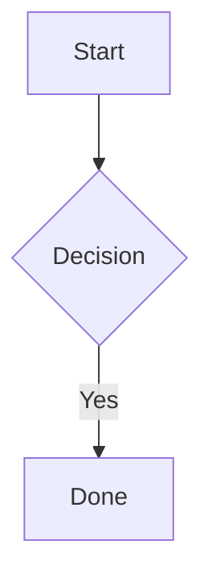
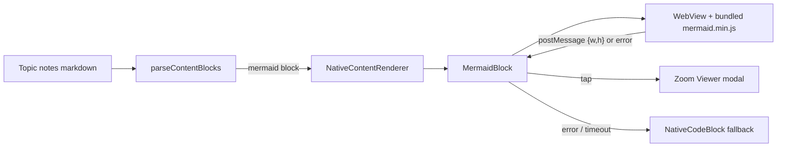

# SRS: Offline Mermaid Diagram Rendering in Topic Notes

| Field | Value |
|---|---|
| Document | Software Requirements Specification |
| Status | Draft for review |
| Scope | `src/utils/nativeContentParser.ts`, `src/components/NativeContentRenderer.tsx`, `src/theme/markdownStyles.tsx`, new `src/components/MermaidBlock*.tsx`, new bundled mermaid asset, `package.json`, `metro.config.js` |
| Decisions already taken | Diagrams **must work offline**; diagrams **open in a zoomable full-screen viewer** |

---

## 1. Context & Motivation

Topic notes (`TopicNotesScreen` → `NativeContentRenderer`) are authored in Markdown. Authors write flowcharts, sequence diagrams, ER diagrams, etc. as fenced blocks:

````

````

Today `parseContentBlocks` treats any fence as code, so students see raw diagram source instead of a diagram. Mermaid needs a browser DOM (SVG text measurement, layout), so it cannot run in React Native directly; it will run inside a WebView. Because students study offline (commute, poor connectivity), the Mermaid runtime must ship **inside the app**, not load from a CDN.

---

## 2. Definitions

| Term | Meaning |
|---|---|
| Diagram block | A fenced block whose info string is `mermaid` (case-insensitive) |
| Inline view | The diagram as rendered in the notes scroll flow |
| Viewer | Full-screen modal showing one diagram with pan and pinch-zoom |
| Runtime | The bundled `mermaid.min.js` file |

---

## 3. Functional Requirements

### 3.1 Detection & parsing
- **FR-1** `parseContentBlocks` SHALL emit a new block `{ type: 'mermaid', code }` for every fence whose language is `mermaid` (case-insensitive, e.g. `Mermaid`, `MERMAID`).
- **FR-2** Surrounding markdown, code blocks, and display math in the same note SHALL be unaffected and keep their order.
- **FR-3** Fences with CRLF line endings, trailing whitespace after the info string, and indented fences SHALL be detected.
- **FR-4** An unclosed ```` ```mermaid ```` fence SHALL NOT crash parsing; it SHALL fall back to the current behaviour (rendered as markdown/code).
- **FR-5** Mermaid fences nested inside markdown structures (e.g. list items) that reach the `fence` rule in `markdownStyles.tsx` SHALL also render as diagrams.

### 3.2 Rendering
- **FR-6** `NativeContentRenderer` SHALL render each `mermaid` block with `MermaidBlock`, wrapped in `ContentErrorBoundary` with the diagram source as fallback text.
- **FR-7** `MermaidBlock` SHALL render the diagram in a `react-native-webview` that loads the **bundled** runtime (no network request).
- **FR-8** The diagram source SHALL be delivered to the WebView through message passing or an injected JSON-encoded string, **never** by string-concatenating it into HTML or script.
- **FR-9** Supported diagram types SHALL be those of the bundled Mermaid version (flowchart, sequence, class, state, ER, gantt, pie, mindmap, journey at minimum).
- **FR-10** Diagram colours and fonts SHALL follow the app theme (`COLORS`, mono font) via Mermaid `themeVariables`, so diagrams look native to the app.
- **FR-11** The inline view SHALL size itself to the rendered SVG: the WebView reports `{ width, height }` and the component sets its height so the diagram has **no inner vertical scrolling**. Diagrams wider than the container SHALL scale down to fit the width (the viewer provides detail).
- **FR-12** While rendering, a `CircleLoader` SHALL be shown in a placeholder of reserved minimum height (no layout jump when the diagram appears).

### 3.3 Zoom viewer
- **FR-13** Tapping an inline diagram SHALL open the Viewer as a full-screen modal.
- **FR-14** The Viewer SHALL support pinch-to-zoom (min 1x, max at least 5x), pan while zoomed, and double-tap to toggle zoom.
- **FR-15** The Viewer SHALL show a close button (top corner, min 44×44 pt hit area) and SHALL close on Android hardware back and on iOS swipe-down/close.
- **FR-16** The Viewer SHALL render the same diagram at full width, without re-fetching anything and without visible re-render flicker.
- **FR-17** Inline views SHALL NOT capture pinch or vertical-scroll gestures; the notes `ScrollView` must scroll normally while the finger is over a diagram. Only a tap opens the Viewer.
- **FR-18** An "Expand" affordance (small icon or caption such as "Tap to zoom") SHALL be visible on each rendered diagram.

### 3.4 Error handling & fallback
- **FR-19** If Mermaid reports a syntax error, the block SHALL show the diagram source in the existing `NativeCodeBlock` plus a short, non-blocking message ("Couldn't render this diagram"). The rest of the note SHALL be unaffected.
- **FR-20** If the WebView fails to load or crashes (including the Android renderer-process-gone event), the block SHALL show the same fallback, and a "Retry" action SHALL be offered.
- **FR-21** A render that does not complete within 10 s SHALL be treated as failed (FR-19 fallback).

### 3.5 Copy & accessibility
- **FR-22** Long-pressing a diagram (or an action in the Viewer) SHALL allow copying the diagram source text.
- **FR-23** Each diagram SHALL have an accessibility label ("Diagram. Double tap to enlarge") and the Viewer close button SHALL be labelled.

### 3.6 Platform support
- **FR-24** Android and iOS SHALL be fully supported.
- **FR-25** Web (`app.json` defines a web target; `react-native-webview` does not work there) SHOULD render through an `<iframe srcDoc>` variant in `MermaidBlock.web.tsx`; if not implemented in v1, web SHALL show the code-block fallback (FR-19 style) and MUST NOT crash.

---

## 4. Non-Functional Requirements

### 4.1 Offline
- **NFR-1** With airplane mode on and a cold app start, diagrams SHALL render. No network request SHALL be made by `MermaidBlock`.
- **NFR-2** The runtime SHALL be a single pinned Mermaid version, committed or reproducibly copied at install time; upgrades are deliberate.

### 4.2 Performance
- **NFR-3** Time to first diagram (warm WebView, typical 10-node flowchart) ≤ 1.5 s on a mid-range Android device; cold ≤ 3 s.
- **NFR-4** Each WebView is heavy. A note with many diagrams SHALL mount WebViews lazily (only when within ~1 screen of the viewport) and SHALL unmount or snapshot those far away. At most **3 live WebViews** at once.
- **NFR-5** Measured diagram height SHALL be cached by a hash of the source so revisits do not cause layout jumps.
- **NFR-6** Opening/closing the Viewer SHALL NOT drop frames noticeably on a mid-range device (target ≥ 50 fps during open animation).
- **NFR-7** The runtime file SHALL be read from disk once per session and reused across all `MermaidBlock` instances.

### 4.3 Security
- **NFR-8** Mermaid SHALL run with `securityLevel: 'strict'` (no click handlers, HTML labels sanitised).
- **NFR-9** The WebView SHALL set `originWhitelist` to local/`about:blank` only, block all navigation away from the page, and disable file access except the runtime asset, DOM storage, and third-party cookies.
- **NFR-10** Diagram source SHALL be treated as untrusted (FR-8).

### 4.4 Size & build
- **NFR-11** The mermaid bundle adds roughly 2.5 MB to the app; this is accepted. Release builds SHALL NOT include source maps for it.
- **NFR-12** Native linking happens through `expo prebuild --clean` in `.github/workflows/release.yml`. No manual `android/` or `ios/` edits, and no `eas build` (repo rule).
- **NFR-13** Prefer Expo libraries: `react-native-webview` installed via `npx expo install`; asset access through `expo-asset` and `expo-file-system`, verified against the v57 docs before coding.

### 4.5 Reliability & UX
- **NFR-14** A failing diagram SHALL never crash the notes screen (error boundary + FR-19/20).
- **NFR-15** Layout SHALL be responsive: phone, tablet, and laptop widths, with the Viewer using the full window.
- **NFR-16** Inline diagrams SHALL use the app's card style (border, radius, background) consistent with `NativeCodeBlock`.
- **NFR-17** Light analytics event on `diagram_viewer_open` (optional, uses existing `src/utils/analytics.ts`).

---

## 5. Architecture



**Offline runtime loading:** `mermaid.min.js` is shipped as an asset (extension registered in Metro `assetExts`, e.g. `.txt`/`.jsmd`), resolved with `expo-asset`, read once with `expo-file-system`, cached in memory, and inlined into the WebView HTML (`source={{ html }}`). This avoids `file://` access flags and CORS issues.

**Message protocol (WebView → RN):** `{ type:'ready' }`, `{ type:'size', width, height }`, `{ type:'error', message }`. **RN → WebView:** `{ type:'render', code, theme }` via `injectJavaScript`/`postMessage`.

---

## 6. Files to change / add

| File | Change |
|---|---|
| `package.json` | add `react-native-webview`, `mermaid` (pinned), plus `expo-asset` / `expo-file-system` if missing |
| `metro.config.js` | register runtime asset extension |
| `scripts/copy-mermaid.js` (or committed asset) | place `mermaid.min.js` into `assets/` |
| `src/utils/nativeContentParser.ts` | `mermaid` block type (FR-1..5) |
| `src/components/MermaidBlock.tsx` | new inline renderer (FR-6..12, 19..23) |
| `src/components/MermaidViewer.tsx` | new zoom modal (FR-13..18) |
| `src/components/MermaidBlock.web.tsx` | web variant (FR-25) |
| `src/components/NativeContentRenderer.tsx` | new branch for `mermaid` |
| `src/theme/markdownStyles.tsx` | `fence` rule routes `mermaid` (FR-5) |

---

## 7. Acceptance Criteria

1. A note containing a valid ```` ```mermaid ```` block shows a diagram, not source, on Android and iOS.
2. In airplane mode with the app freshly launched, the same note still shows the diagram (NFR-1).
3. Tapping the diagram opens the Viewer; pinch zooms to ≥ 5x, pan works, back/close returns to the note at the same scroll position.
4. Scrolling the note with a finger on a diagram scrolls the note; no accidental zoom or stuck gestures.
5. A diagram with a syntax error shows the source and the message; the rest of the note renders normally.
6. A note with 10 diagrams stays responsive, with no more than 3 live WebViews and no layout jumps on revisit.
7. A release build via the GitHub Actions workflow includes the runtime and works offline.
8. Parser unit tests cover FR-1..4 (case variants, CRLF, mixed content, unclosed fence).

---

## 8. Out of Scope (v1)
- Editing diagrams in-app.
- Exporting or sharing diagrams as images.
- Rendering Mermaid in question/solution text outside the shared renderer (they get it for free through `NativeContentRenderer` but are not specifically tested).
- Dark-theme variants (theme vars are centralised for later).

## 9. Open Items
1. **Web target:** FR-25 is SHOULD. Confirm whether the web build is actively used; if not, v1 ships the code-block fallback there.
2. **Mermaid version pin:** to be chosen at implementation (latest stable that runs in the Android WebView baseline).
3. **WebView cap (NFR-4):** 3 live WebViews is a starting value; tune after device testing.
